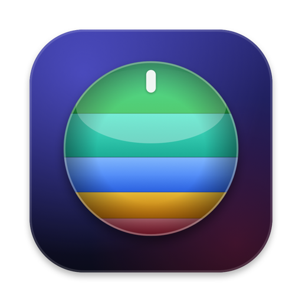
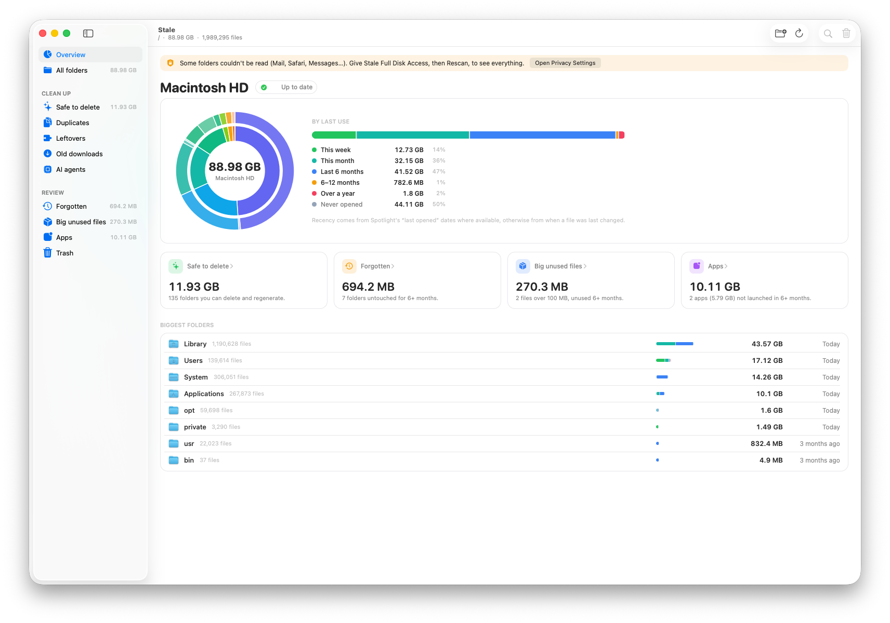

<p align="center"></p>

<h1 align="center">Stale</h1>

<p align="center">See what you use on your Mac, what you don't, and when you last touched it.</p>

<p align="center">
  <a href="https://stale.f-dobinciuc7.workers.dev/download"><b>Download for Mac</b></a> ·
  <a href="https://stale.f-dobinciuc7.workers.dev">Website</a> ·
  <a href="https://github.com/HustleCoding/stale/releases">Releases</a>
</p>



Stale indexes your whole disk once and sorts everything by when you last used it,
using the "Last opened" dates macOS already keeps plus file modification times.
It then helps you get space back, and everything it removes goes to the Trash.

## Install

- **Download:** get the DMG from the [website](https://stale.f-dobinciuc7.workers.dev)
  and drag Stale to Applications.
- **Homebrew:**
  ```sh
  brew tap hustlecoding/stale https://github.com/HustleCoding/stale
  brew install --cask stale
  ```

Requires macOS 12 or later, Apple silicon or Intel. On first launch Stale asks for
**Full Disk Access** so it can see protected folders like Mail and Safari; it works
without it, but those folders are left out.

## What it does

| Section | Shows |
| --- | --- |
| **Overview** | Disk usage as a ring, and how much was used this week, this month, in the last 6 months, over a year ago or never |
| **All folders** | Every folder and file by size, with when it was last used |
| **Safe to delete** | Caches, build output, `node_modules`, Xcode and Docker data: things tools rebuild |
| **Duplicates** | Files of 4 MB or more with identical content (checked byte for byte) |
| **Leftovers** | Library data of apps you've uninstalled, old iPhone and iPad backups |
| **Old downloads** | Downloads not opened for 30 days, and installers for apps you already have |
| **AI agents** | Worktrees, caches, logs, old transcripts and local models from Codex, Cursor, Claude Code, Conductor and similar tools |
| **Forgotten / Big unused files / Apps** | Folders, big files and apps you haven't opened in months |
| **Trash** | What's in the Trash, with Empty Trash |

Cleanup sections preselect only what's safe to remove, so you can review and click
**Move to Trash**. A few rules: an agent worktree is preselected only after 14 days
untouched with no uncommitted changes, and local models are never preselected.
Only the Trash page's **Empty Trash…** deletes for good.

**Fast.** Stale reopens from its saved index in about 0.1 s, and keeps up with
changes through FSEvents, so it never rescans on launch. **Rescan** is there when
you want it.

**Private.** Stale reads only file sizes and dates. There is no account and no
analytics, and nothing leaves your Mac. The only network access is the daily
[Sparkle](https://sparkle-project.org) update check, and updates install themselves.

## Command line

Building from source also gives you a `stale` command:

| Command | What it does |
| --- | --- |
| `stale [path]` | Usage report for a folder (default `~`) |
| `stale ls <path>` | A folder's contents by size, with last-used age and category |
| `stale apps` | Apps by when you last launched them |
| `stale trash [path]` | Move unused, rebuildable folders to the Trash (asks first) |

Common options: `--json`, `--top N`, `--no-spotlight`. For `trash`: `--older 30d|6mo|1y`,
`--category node_modules,build,venv,cache,xcode,docker`, `--dry-run`, `-y`.

"Last used" is the later of Spotlight's last-opened date and the modification time;
a folder takes the newest of its contents. Sizes are what files actually take on
disk, so APFS clones and sparse files aren't overcounted.

## Build from source

```sh
make              # build/stale and build/Stale.app, universal
make ARCHS=arm64  # quicker local build
make install      # /usr/local/bin/stale and /Applications/Stale.app
```

Needs the Xcode Command Line Tools. The only dependency, Sparkle, is downloaded on
first build and checked against a pinned SHA-256. Signing, notarizing, releases,
the website and the Homebrew cask are covered in [docs/RELEASING.md](docs/RELEASING.md).

## License

[MIT](LICENSE)
